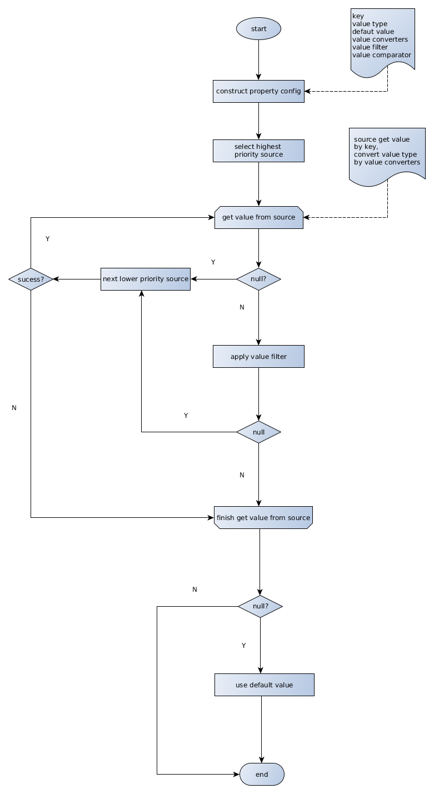

# SCF: Simple Configuration Facade

[SCF](https://github.com/mydotey/scf), short for Simple Configuration Facade, is an abtraction between **Code** and **Outer Configuration** (properties file, env variable, system property, yaml file, ... , etc.). It's namely like [slf4j](https://www.slf4j.org/) (Simple Logging Facade for Java), and has the same position in the configuration world.

## Usage

- java: https://github.com/mydotey/scf/tree/master/java

- dotnet: https://github.com/mydotey/scf/tree/master/dotnet

## Examples

https://github.com/mydotey/scf-best-practice

## Features

### Strong Type

Core abstraction is Property<K, V>, with strong-typed K & strong-typed value.

### Safe

A value filter can be used to prevent bad property value configured.

### Dynamic

Each property can be dynamic & listenable if it changes dynamicly.

### Multiple Sources

Multiple sources can work together with different priorities. Property value is caculated by their priority automatically.

### Extensible

**scf-core** only has a few interface abstractions and default implementation. Feel free to extend the default or write your own new implementation.

Some extentions:

- [scf-simple](https://github.com/mydotey/scf-simple)

- [scf-labeled](https://github.com/mydotey/scf-labeled)

- [scf-yaml](https://github.com/mydotey/scf-yaml)

- [scf-apollo](https://github.com/mydotey/scf-apollo)

### Lightweight

No thread is used. Only use a little memory to cache the properties.

### Easy to Use

**scf-simple** gives implementation on the most common used simplest `Property<String, String>`: properties file, memory Map, system properties, env variables, etc.

See also:

- [Usage](#usage)

- [Examples](#examples)

## Core Concepts

### Property

A configuration item is used standalone in *Code*, with a unique *Property Config* and a *strong-typed Value*.

*Code* can listen the change of a *dynamic changed* property. Value of dynamic property is updated by the *Configuration Manager* automatically.

### Property Config

Config for a *Property* with the following parts:

- **Key**: uniquely identifies a *Property* in a *Configuration Manager*, can be a *String*, or any other *strong-typed object*

- **Value Type**: value type of a properpty

- **Default Value**: used when *Property* not configured in any *Configuration Source*

- **Value Converter**: convert a value to another type, a source has <K, V1>, but the *Code* needs <K, V2>, a converter <V1, V2> can be used to automatically convert value of type V1 to value of type V2

- **Value Filter**: give a chance to check the value got from the *Configuration Source*, mostly used to **validate** the value

### Configuration Source

A property can be configured in various ways. For example, a HashMap in memory, or a properties file, or env variable, or Java system property, or yaml file, ... etc.

Multiple ways can be used together! Each way is a configuration source. Each source is responsible for providing a value for a property.

Sometimes a source cannot provide a value, provide null instead.

- The key is not recognized by the source. For example, key type is another strong-typed object *{ key: request.timeout, labels: { dc: aws-us-east1, app: 100000 } }*, but the source only accepts *String key*.

- The property is not configured in the source.

- The property value in the source is of type A, but the code needs type B, and no converter <A, B> provided in the property config

### Configuration Manager

A configuration manager is a configuration facade for the *Code*. *Code* gets a property from the manager, and doesn't care how/where the property is configured.

Manager provides 2 kinds of API:

- `<K, V> Property<K, V> getProperty(PropertyConfig<K, V> config)`: used for **stable** properties with a **stable** key, returns a **unique** property object. **Manager** keeps the stable properties and updates them automatically when property value changes. **Code** can keep it somewhere and use it multiple times.

- `<V> V getPropertyValue(PropertyConfig<K, V> config)`: used for **non-stable** properties with a **non-stable** key. For example, a visitor **IP** is used as part of a key, don't know how many keys app has, don't know when the property is configured and used.

#### Sources & Source Priority

A manager can manage multiple configuration sources. **Different source has different priority.** The manager gets property value from the sources in the order of the source priority.

### Relationship of Core Concepts

## Core Logic

## Developers

- Qiang Zhao <koqizhao@outlook.com>
